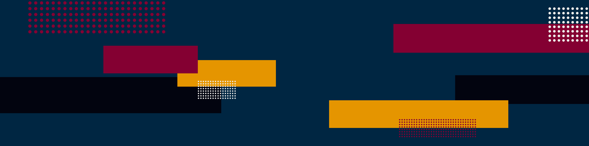

# Stephanie Wiggins' Portfolio

Hi, I'm Stephanie Wiggins. I weave my UX/UI web design and development skills
with a project’s initiatives to create user-centric, cohesive experiences that
are both beautiful and enjoyable to use.

View my portfolio: https://stephaniewiggins.me/

## View Locally
This website was built using [Gatsby](https://www.gatsbyjs.com/) and deploys the `main` branch using [Netlify](https://www.netlify.com/). To
view this repo locally follow the instructions below.
1. Clone the repo.
2. Navigate into the folder locally.
3. Install dependencies – `npm install`.
4. Build the Gatsby assets using the [Gatsby CLI](https://www.gatsbyjs.com/docs/reference/gatsby-cli/) – `gatsby build`.
5. View the site – `gatsby develop`.
